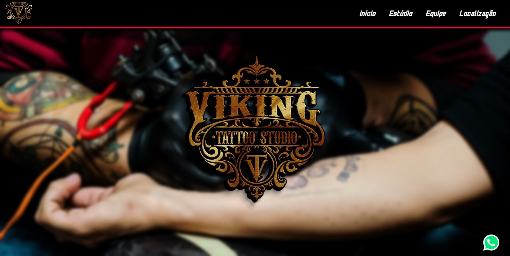
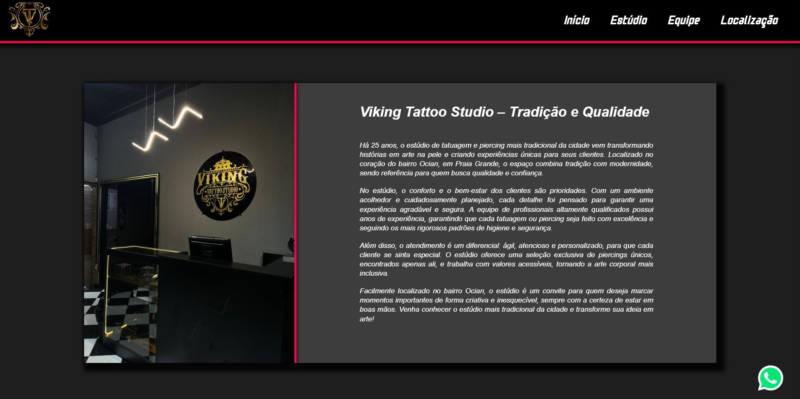
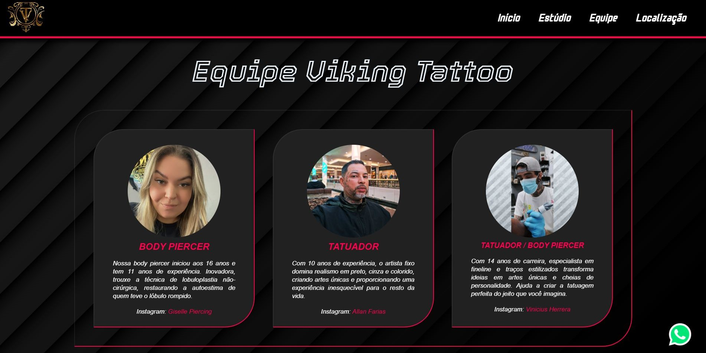
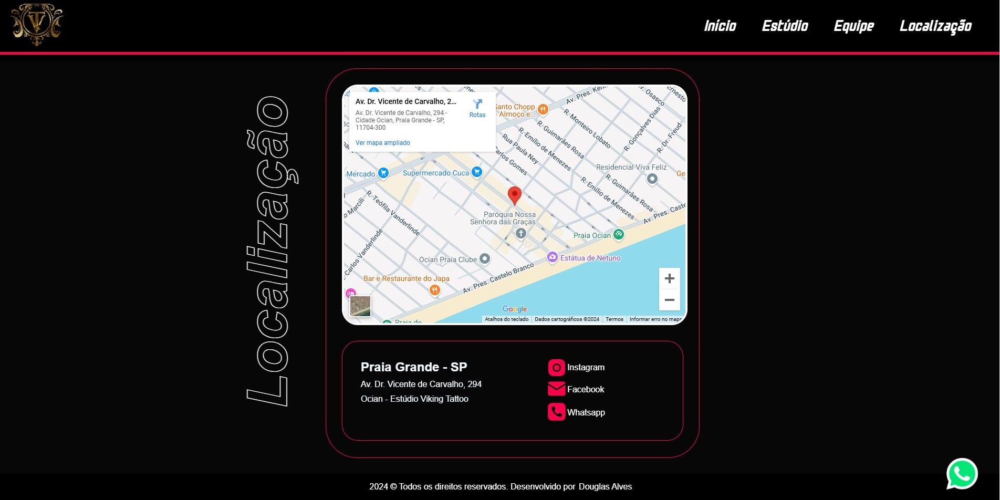

# 🚀 Projeto Site de Estúdio de Tatuagem

 

## Descrição
Desenvolvimento do site da Viking Tattoo Studio em formato de Landing Page. 

---

## 📋 Sumário

- [Funcionalidades](#funcionalidades)
- [Tecnologias](#tecnologias)
- [Instalação e Utilização](#como-usar)
- [Contribuições](#contribuicoes)
- [Licença](#licenca)
- [Contato](#contato)

---

## ✅ Funcionalidades 

-  Funcionalidade 1 - Apresentação do ambiente e dos profissionais para os clientes 
-  Funcionalidade 2 - Facilidade para entrar em contato com a empresa
-  Funcionalidade 3 - Praticidade ao procurar os serviços e os profissionais disponíveis
-  Funcionalidade 4 - Facilidade em localizar a empresa

---

## 🛠️ Tecnologias 

- **Linguagem**: HTML, CSS

---

## 🚀 Instalação e Utilização

- clone o repositório
- abra a pasta do repositório, localize o arquivo "index.html" e abra em seu navegador

---

## 🤝 Contribuições 

Caso tenha ideias para evolução ou adaptação do projeto sinta-se a vontade para fazer uma contribuição.

---

## 📄 Licença 

Este projeto está sob a licença [MIT](LICENSE).

---

## 📧 Contato 

Caso tenha interesse em comunicar-se comigo, por favor utilize as opções abaixo:

- **Email**: 0285douglas@gmail.com
- **LinkedIn**: [Douglas Alves](https://linkedin.com/in/douglas-alves-curriculo)

